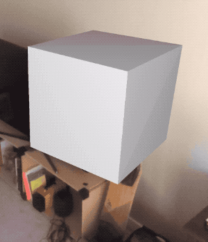

# ARKit + SceneKit Geometries Tutorial Part 2 Repository

[Check out the Medium post that goes with this repo!](https://medium.com/@maxxfrazer/arkit-scenekit-geometries-tutorial-part-2-ff315d8d7030)

Tutorial examples:

